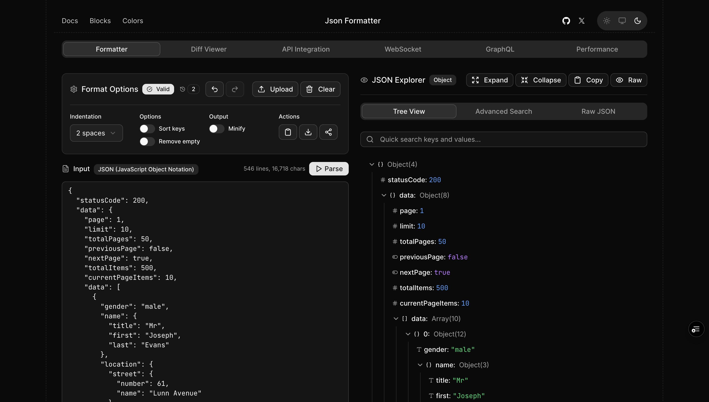

<h1 align="center">JSON Formatter by Spectrum UI</h1>

All-in-one JSON toolkit. Format, validate, convert, and test APIs—all in your browser.

## Features

- **Format & Validate** - Beautify, minify, and validate JSON with real-time error detection
- **Convert** - Transform between JSON, CSV, XML, and YAML
- **Tree View** - Interactive visualization of nested structures
- **Diff** - Compare two JSON files side-by-side
- **API Testing** - Test REST endpoints with request/response formatting
- **WebSocket** - Connect and test WebSocket connections
- **GraphQL** - Query playground with schema exploration
- **Performance** - Benchmark API response times
- **Search** - JSONPath queries to find data quickly
- **Share** - Generate shareable URLs (state stored in URL)
  

Built by [Arihant Jain](https://x.com/arihantCodes) · [Spectrum UI](https://ui.spectrumhq.in)
